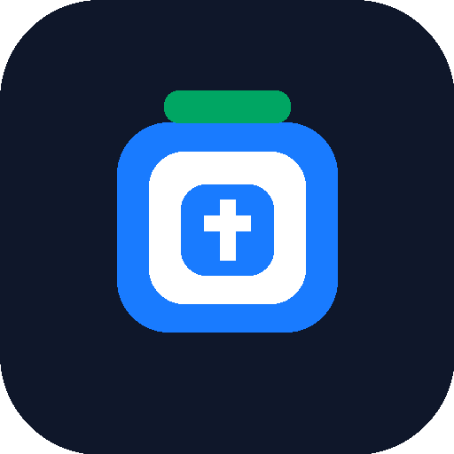

# BucketDesk



**BucketDesk** یک MinIO GUI و S3-compatible bucket manager سبک و دو زبانه است؛ برای تیم‌هایی که می‌خواهند فایل‌ها و objectها را مدیریت کنند، اما MinIO Console کامل را در اختیار کاربران قرار ندهند.

English: [README](../README.md)

## کاربرد

BucketDesk به کاربران اجازه می‌دهد bucket را مرور کنند، فایل آپلود کنند، objectهای انتخاب‌شده را حذف کنند و URL عمومی objectها را کپی کنند. ادمین همچنان می‌تواند دسترسی را با access key محدود و policyهای S3 کنترل کند.

## قابلیت‌ها

- رابط کاربری دو زبانه: فارسی و انگلیسی.
- تغییر خودکار جهت صفحه بین RTL و LTR.
- چند پروفایل اتصال MinIO/S3.
- تنظیم Endpoint، Bucket، Region، CDN URL و Path-style.
- تست اتصال و بررسی دسترسی نوشتن روی bucket.
- مرور bucket مثل پوشه‌ها با S3 prefix.
- آپلود چند فایل در مسیر فعلی.
- انتخاب و حذف objectها.
- کپی URL عمومی objectها.
- اجرای محلی، بدون سرویس خارجی، دیتابیس یا telemetry.
- نسخه پرتابل برای Windows، macOS و Linux.
- نصب‌کننده برای Windows، macOS و Linux.

## دانلود و نصب

به صفحه [GitHub Releases](https://github.com/PouryaMansouri/BucketDesk/releases) بروید و فایل مناسب سیستم‌عامل خودتان را بگیرید.

| سیستم‌عامل | پیشنهاد نصب | نسخه پرتابل |
| --- | --- | --- |
| Windows | فایل setup با پسوند `.exe` | فایل `.zip` شامل `bucketdesk.exe` |
| macOS Apple Silicon | فایل `.dmg` نسخه `arm64` | فایل `.tar.gz` نسخه `darwin_arm64` |
| macOS Intel | فایل `.dmg` نسخه `amd64` | فایل `.tar.gz` نسخه `darwin_amd64` |
| Linux amd64 | فایل `.AppImage` یا `.deb` | فایل `.tar.gz` نسخه `linux_amd64` |
| Linux arm64 | فایل `.deb` یا `.tar.gz` | فایل `.tar.gz` نسخه `linux_arm64` |

### Windows

فایل setup را اجرا کنید و بعد BucketDesk را از Start Menu یا shortcut دسکتاپ باز کنید.

حالت پرتابل: فایل `.zip` را extract کنید و `bucketdesk.exe` را اجرا کنید.

### macOS

فایل `.dmg` را باز کنید و `BucketDesk.app` را اجرا کنید.

اگر macOS هشدار unidentified developer داد، روی app راست‌کلیک کنید و **Open** را بزنید. وقتی signing و notarization فعال شود، این هشدار حذف می‌شود.

حالت پرتابل: فایل `.tar.gz` را extract کنید و باینری `bucketdesk` را اجرا کنید.

### Linux

برای AppImage:

```bash
chmod +x BucketDesk_v0.1.0_linux_x86_64.AppImage
./BucketDesk_v0.1.0_linux_x86_64.AppImage
```

برای Debian/Ubuntu:

```bash
sudo dpkg -i bucketdesk_v0.1.0_linux_amd64.deb
```

حالت پرتابل: فایل `.tar.gz` را extract کنید و `bucketdesk` را اجرا کنید.

## روش استفاده

1. BucketDesk را باز کنید.
2. یک profile بسازید.
3. Endpoint، Access Key، Secret Key، Region و Bucket را وارد کنید.
4. برای بیشتر نصب‌های MinIO گزینه **Use Path-Style Endpoint** را روشن بگذارید.
5. روی **Test connection** کلیک کنید.
6. تنظیمات را **Save** کنید.
7. فایل آپلود کنید، prefixها را مرور کنید، URL کپی کنید یا objectهای انتخاب‌شده را حذف کنید.

BucketDesk فقط روی `127.0.0.1` اجرا می‌شود و credentialها را به هیچ سرویس خارجی نمی‌فرستد.

## مدل امنیتی پیشنهادی

از credential ریشه MinIO استفاده نکنید.

برای هر تیم یا جریان کاری یک access key جدا بسازید و دسترسی آن را فقط به bucket و prefixهای لازم محدود کنید. نمونه policyها:

[IAM policy examples](./IAM_POLICIES.md)

## توسعه

اجرای بک‌اند:

```bash
go run ./cmd/bucketdesk
```

اجرای UI در حالت توسعه:

```bash
npm install
npm run dev:web
```

## ساخت خروجی

```bash
go build -o dist/bucketdesk ./cmd/bucketdesk
```

## انتشار نسخه

```bash
git tag v0.1.0
git push origin v0.1.0
```

Workflow انتشار این فایل‌ها را می‌سازد:

- نصب‌کننده `.exe` برای Windows
- فایل `.dmg` برای macOS Intel و Apple Silicon
- فایل `.deb` برای Linux amd64 و arm64
- فایل `.AppImage` برای Linux x86_64
- نسخه‌های پرتابل برای Windows، macOS و Linux

## Roadmap

BucketDesk برای مشارکت عمومی باز است. issue، پیشنهاد قابلیت، بهبود مستندات، ترجمه، تست روی سیستم‌عامل‌های مختلف و pull request خوش‌آمد است.

برنامه‌های بعدی:

- ذخیره Secret Key در Keychain/Windows Credential Manager/libsecret.
- امضای نصب‌کننده Windows.
- signing و notarization برای DMG مک.
- بهتر کردن AppImage و اضافه کردن Flatpak.
- ساخت presigned URL.
- محدودیت prefix در UI.
- پروفایل read-only.
- ویرایش metadata objectها.
- آپلود پوشه با drag-and-drop.
- تست خودکار UI برای releaseها.

## مشارکت

[CONTRIBUTING.md](../CONTRIBUTING.md)

## امنیت

[SECURITY.md](../SECURITY.md)

## مجوز

BucketDesk تحت Apache License 2.0 منتشر می‌شود. فایل [LICENSE](../LICENSE) را ببینید.
